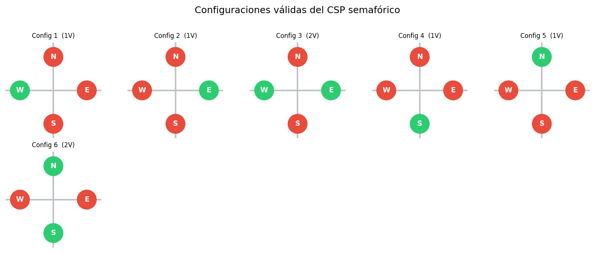
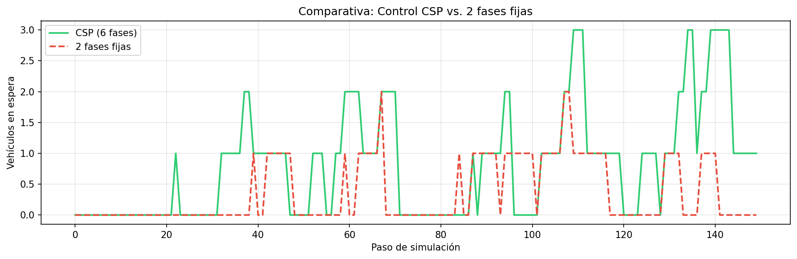
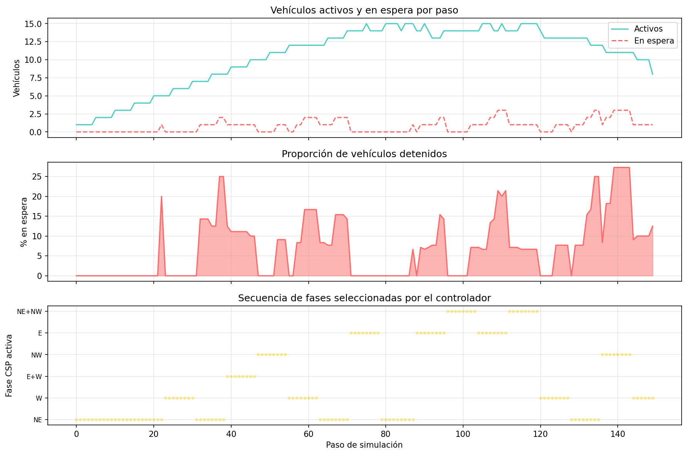
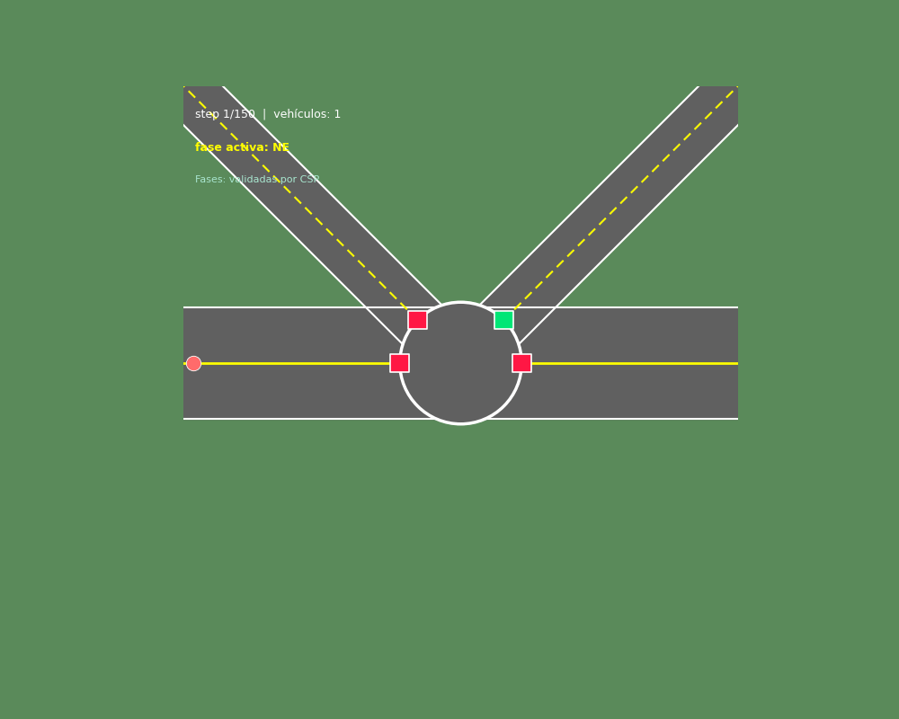

# Vialidad-IO

Adaptive traffic-light control for a signalised intersection, modelled with **Constraint Satisfaction (CSP)** and **Multi-Agent Simulation (Mesa)**.

The CSP layer enumerates every safe phase configuration (no two crossing arms green at once); the multi-agent layer runs vehicles through the intersection and uses those configurations for queue-adaptive phase switching.

---

## Results

| Valid CSP configurations | CSP vs. fixed-phase comparison |
|---|---|
|  |  |

**Simulation metrics (CSP control)**



**Combined animation**



---

## Project structure

```
Vialidad-IO/
├── notebooks/
│   ├── CSP_Traffic.ipynb       # CSP solver — enumerates valid phases
│   ├── modelL.ipynb            # Mesa multi-agent simulation
│   └── CSP_MultiAgent.ipynb    # Integrated model (CSP + agents)
├── models/
│   ├── main.tex                # Formal mathematical model (LaTeX)
│   └── main.pdf                # Compiled PDF
├── reports/
│   ├── csp_configurations*.png
│   ├── csp_multiagent_metrics.png
│   ├── csp_vs_fixed_comparison.png
│   └── figures/
│       └── csp_multiagent_simulation.gif
├── data/
├── docs/
└── requirements.txt
```

---

## Architecture

### CSP layer (`CSP_Traffic.ipynb`)

- **Variables**: `W`, `E`, `NW`, `NE` — binary state (0 = Red, 1 = Green) for each arm.
- **Constraints**: crossing arms cannot both be green; at least one arm must be green (liveness).
- **Solver**: hand-written recursive backtracking (`backtrack()` + `is_valid()`).
- **Output**: 6 valid phase configurations as `list[frozenset[Arm]]`.

The formal definition is in `models/main.tex` / `models/main.pdf`.

### Multi-agent layer (`modelL.ipynb`)

Built on **Mesa 3.5**. Three classes:

| Class | Role |
|---|---|
| `Arm` (Enum) | Maps arm names to intersection geometry |
| `TrafficLight` | One per arm; holds `state = "green" \| "red"` |
| `Vehicle` | Follows a 5-waypoint route; stops at the stop line when red |
| `Cruce` (Model) | Spawns vehicles on a schedule; runs adaptive phase control each step |

Intersection center at `(10, 10)`, plaza circle radius `R = 2.2`. Phase control switches to the CSP-valid phase with the longest queue after `min_green` steps, or forces a switch after `max_green` steps.

### Integration (`CSP_MultiAgent.ipynb`)

`Cruce` accepts `csp_phases: list[frozenset[Arm]]` — the direct output of the CSP solver — as its set of allowable phases. Passing `FIXED_PHASES` (2-phase avenue + diagonal) reproduces baseline behaviour for comparison.

---

## Setup

Two Python environments are used:

| Environment | Purpose |
|---|---|
| `.venv/` (Python 3.14) | `CSP_Traffic.ipynb` — matplotlib, numpy, pandas |
| `analisis-vial/venv/` | `modelL.ipynb`, `CSP_MultiAgent.ipynb` — requires Mesa 3.5 |

**Install dependencies (analisis-vial venv)**

```bash
pip install -r requirements.txt
```

**Launch Jupyter**

```bash
# Mesa notebooks
/Users/angelluna/Documents/STEM_PROJECTS/py/analisis-vial/venv/bin/jupyter notebook

# CSP-only notebook
source .venv/bin/activate && jupyter notebook
```

**Compile the formal model**

```bash
cd models && latexmk -pdf main.tex
```

---

## Notebooks

| Notebook | Description | Kernel |
|---|---|---|
| `CSP_Traffic.ipynb` | Enumerates and visualises all valid phase configurations | `.venv` |
| `modelL.ipynb` | Mesa simulation with fixed phases | `analisis-vial` |
| `CSP_MultiAgent.ipynb` | Full integrated model with CSP-driven adaptive control | `analisis-vial` |

> The `FutureWarning` about `seed` vs `rng` in Mesa output is expected and non-breaking.
